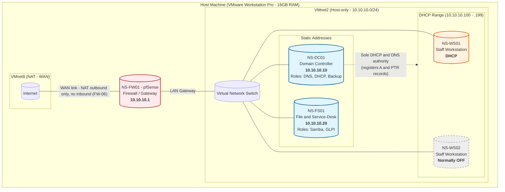

# Nord-Systems

A simulated small-office IT infrastructure and System Admin project built using VMware Workstation Pro, Windows Server, Windows clients, Linux services, and pfSense.

> **Project status:** Planning and design complete. Infrastructure implementation is in progress.

## Executive Summary

Nord Systems is a simulated organization created to provide a realistic business context for this virtual IT lab. The project models the planning, deployment, administration, security, troubleshooting, and documentation of a small-office IT environment.

The environment will support centralized identity management, network services, shared resources, workstation access, service-desk operations, backup and recovery, and common help-desk scenarios.

This repository documents the project design, implementation records, administrative procedures, troubleshooting activities, scripts, tickets, and validation evidence.

## Problem Statement

Nord Systems requires a centrally managed IT environment that can securely support staff workstations, user accounts, shared resources, network services, and technical-support operations.

The environment must provide:

- Centralized user and group administration
- Secure authentication and workstation access
- DNS and DHCP services
- Role-based access to shared resources
- Network isolation and controlled internet access
- Service-desk ticket management
- Backup and recovery capabilities
- Repeatable troubleshooting and administration procedures
- Technical documentation and implementation evidence

## Project Objectives

- Build an isolated virtual office network using VMware Workstation Pro.
- Configure pfSense as the network firewall and default gateway.
- Deploy Active Directory Domain Services using `corp.nordsystems.com`.
- Configure centralized DNS and DHCP services.
- Provision users, groups, organizational units, and workstation accounts.
- Apply security and workstation settings through Group Policy.
- Configure Linux-based file sharing and service-desk services.
- Implement role-based access to shared resources.
- Join Windows 11 workstations to the domain.
- Resolve simulated support tickets involving authentication, permissions, DNS, DHCP, software, connectivity, and performance.
- Implement and validate backup and recovery procedures.
- Document configurations, decisions, procedures, results, and supporting evidence.

## Major Technologies

| Technology | Purpose |
|---|---|
| VMware Workstation Pro | Virtualization platform |
| pfSense | Firewall, gateway, and network isolation |
| Windows Server | Active Directory, DNS, DHCP, and centralized administration |
| Windows 11 Pro | Domain-joined staff workstations |
| Active Directory Domain Services | Identity and access management |
| Group Policy | Centralized workstation and security configuration |
| Linux | File and service-desk server |
| Samba | Network file sharing |
| GLPI | Service-desk and ticket management |
| Veeam Backup & Replication Community Edition | Backup and recovery |
| PowerShell | Windows administration and automation |
| Bash | Linux administration and automation |
| Mermaid | Network architecture documentation |

## Network Architecture

## Project Status

| Area | Status |
|---|---|
| Engagement charter | Complete |
| Requirements and design | Complete |
| Network architecture | Complete |
| Virtual infrastructure deployment | Not started |
| Active Directory deployment | Not started |
| Linux services | Not started |
| Workstation deployment | Not started |
| Backup and recovery | Not started |
| Ticket simulations | Not started |
| Validation evidence | Not started |

Status will be updated as each implementation phase is completed and validated.

## Documentation

- [Engagement Charter](https://docs.google.com/document/d/1u2nWKga73ao-muKXI1qE4YQ5S83IpzOhJL9bC-k0Vcw/edit?usp=sharing)
- [Identity and Access Register](https://docs.google.com/spreadsheets/d/1py0XMVqFYBPXGiFs0JGYm8rhUAfgCWek/edit?usp=sharing&ouid=109457502024142374353&rtpof=true&sd=true)
- [Network Architecture and Addressing plan](docs/02-network-architecture.md)
- [Active directory and Group policy specification](docs/03-ad-and-group-policy.md)
- [Runbooks](runbooks/)
- [Simulated Support Tickets](tickets/)
- [Troubleshooting Guides](troubleshooting/)
- [Automation Scripts](scripts/)
- [Implementation Evidence](evidence/)

## Repository Structure

| Directory | Contents |
|---|---|
| `docs/` | Architecture, access control, build records, and design decisions |
| `diagrams/` | Network diagram source and exported images |
| `runbooks/` | Repeatable administrative and recovery procedures |
| `tickets/` | Simulated service-desk tickets and resolutions |
| `troubleshooting/` | Technical troubleshooting guides |
| `scripts/` | PowerShell and Bash automation |
| `evidence/` | Screenshots and test results validating completed work |

## Disclaimer

Nord Systems is a fictional organization created solely for this simulated lab project. The infrastructure, users, tickets, and business requirements documented here do not represent a real production environment.
