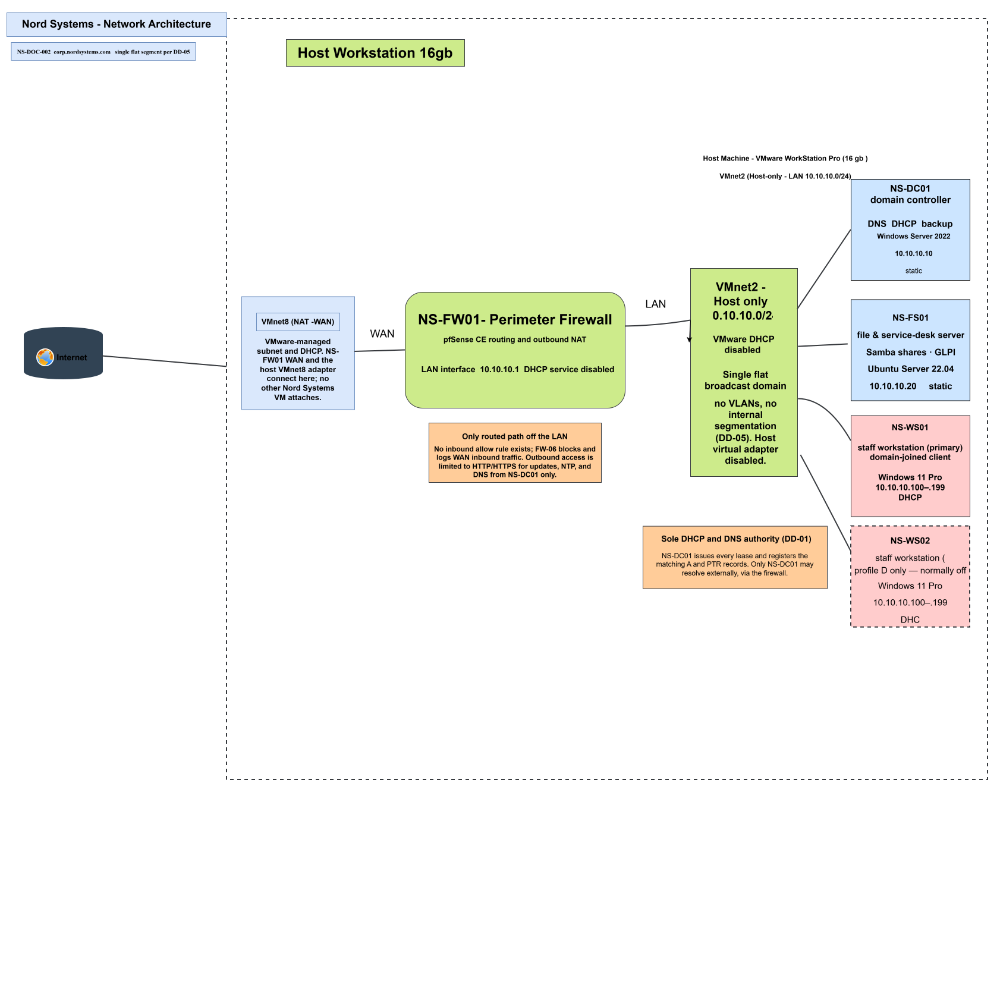

# Nord Systems Network Architecture

Architecture diagram and addressing plan for the simulated Nord Systems environment.

| Field | Value |
|---|---|
| Document ID | NS-DOC-002 |
| Deliverable | D-02 |
| Version | 1.1 |
| Status | Baseline |
| Owner | Infrastructure Engagement Lead |
| Governing document | NS-DOC-001 Engagement Charter v1.2 |

## 1. Purpose and Scope

This document specifies the network layer of the Nord Systems environment: address allocation, DHCP and DNS configuration, the perimeter rule set, and the logical architecture.

It elaborates Charter Sections 5.3 and 5.4.1 to the level of detail required to build and verify the network. Where this document and the charter differ in specificity, the charter defines intent and this document defines configuration.

## 2. Address Allocation

| Parameter | Value |
|---|---|
| Network | `10.10.10.0/24` |
| Subnet mask | `255.255.255.0` |
| Default gateway | `10.10.10.1`, NS-FW01 LAN interface |
| Broadcast | `10.10.10.255` |
| Usable addresses | 254 |
| Virtual switch | VMnet2, host-only, VMware DHCP disabled, host virtual adapter disabled |
| Segments | One, with no VLANs or internal routing boundary (DD-05) |

### 2.1 Allocation Ranges

| Range | Assignment | Notes |
|---|---|---|
| `10.10.10.1` | Gateway | NS-FW01 LAN interface |
| `10.10.10.2-10.10.10.9` | Unallocated | Held for a second gateway or future network appliance |
| `10.10.10.10-10.10.10.19` | Infrastructure servers | Static, with NS-DC01 assigned `.10` |
| `10.10.10.20-10.10.10.29` | Application servers | Static, with NS-FS01 assigned `.20` |
| `10.10.10.30-10.10.10.99` | Unallocated | Held for future static assignments |
| `10.10.10.100-10.10.10.199` | DHCP scope | Dynamic, 100 addresses |
| `10.10.10.200-10.10.10.254` | Reserved | Future expansion |

The otherwise unstated `.2-.9` and `.30-.99` ranges are explicitly recorded as unallocated so an address cannot be assigned from a range that the design does not account for.

## 3. Static Assignments

| Host | Role | Interface | Address | Configured at |
|---|---|---|---|---|
| NS-FW01 | Perimeter firewall | LAN | `10.10.10.1` | pfSense interface configuration |
| NS-FW01 | Perimeter firewall | WAN | VMware-assigned | DHCP client on VMnet8 |
| NS-DC01 | Domain controller, DNS, DHCP, backup | LAN | `10.10.10.10` | Windows network adapter |
| NS-FS01 | Linux file and service-desk server | LAN | `10.10.10.20` | Netplan on the guest |
| NS-WS01 | Primary staff workstation | LAN | DHCP | DHCP scope |
| NS-WS02 | Secondary staff workstation | LAN | DHCP | DHCP scope |

Static addresses are configured on the hosts and are not held as DHCP reservations. Only client workstations use the DHCP scope.

## 4. DHCP Service

**Host:** NS-DC01  
**Authorization:** The DHCP server must be authorized in Active Directory before it will issue leases.

### 4.1 Scope

| Parameter | Value |
|---|---|
| Scope name | Nord Systems Corporate LAN |
| Address range | `10.10.10.100-10.10.10.199` |
| Subnet mask | `255.255.255.0` |
| Exclusions | None, all static addresses are outside the scope |
| Lease duration | 8 days |
| Conflict detection attempts | 1 |
| State | Active |

### 4.2 Scope Options

| Option | Name | Value | Purpose |
|---|---|---|---|
| 003 | Router | `10.10.10.1` | Default gateway |
| 006 | DNS Servers | `10.10.10.10` | NS-DC01 only, with no external resolver offered to clients |
| 015 | DNS Domain Name | `corp.nordsystems.com` | Primary DNS suffix |
| 044 / 046 | WINS | Not configured | NetBIOS name resolution is not used |

Options are set at scope level. This prevents a future scope from inheriting an unintended gateway or DNS configuration.

### 4.3 Dynamic DNS Integration

| Setting | Value |
|---|---|
| Enable DNS dynamic updates | Enabled |
| Update mode | Always dynamically update DNS A and PTR records |
| Discard A and PTR records when a lease is deleted | Enabled |
| Update records for clients that do not request updates | Enabled |
| DNS update credential | `svc-dhcp` |

DHCP registers forward and reverse records on behalf of clients and removes those records when a lease is deleted.

The dedicated `svc-dhcp` account owns dynamically registered records. It has no interactive sign-in rights and exists only for secure DNS updates.

### 4.4 Reservations

No reservations exist at baseline. Both workstations receive ordinary leases. The reservation runbook will be validated through a simulated support ticket.

## 5. DNS Service

### 5.1 Zones

| Zone | Type | Replication | Dynamic updates |
|---|---|---|---|
| `corp.nordsystems.com` | Forward, AD-integrated | All DNS servers in the domain | Secure only |
| `10.10.10.in-addr.arpa` | Reverse, AD-integrated | All DNS servers in the domain | Secure only |

The reverse zone is created explicitly so PTR records can be registered and validated.

### 5.2 Forwarders and Resolution Path

| Setting | Value |
|---|---|
| Forwarder on NS-DC01 | `10.10.10.1`, NS-FW01 |
| Root hints | Not used |
| pfSense DNS resolver | Forwarding mode, using the resolver supplied on VMnet8 |
| Client resolver | NS-DC01 only, delivered by DHCP option 006 |

External resolution follows this path:

1. A client queries NS-DC01.
2. NS-DC01 checks its authoritative zones and cache.
3. Unresolved external queries are forwarded to NS-FW01 at `10.10.10.1`.
4. NS-FW01 forwards the query through its VMnet8 WAN interface.
5. The response returns along the same path and is cached by NS-DC01.

Root hints are disabled to enforce one predictable external resolution path.

### 5.3 Scavenging

| Setting | Value |
|---|---|
| Scavenging | Enabled on the server and both zones |
| No-refresh interval | 7 days |
| Refresh interval | 7 days |
| Relationship to lease duration | The combined 14-day window exceeds the 8-day DHCP lease |

## 6. Perimeter Rule Set

Rules are evaluated from top to bottom and the first match wins. This is a north-south rule set because the single LAN segment has no internal routing boundary.

| ID | Interface | Action | Source | Destination | Purpose |
|---|---|---|---|---|---|
| FW-01 | LAN | Pass | NS-DC01 | This Firewall, port 53 | Only NS-DC01 may query the firewall resolver |
| FW-02 | LAN | Pass | NS-DC01 | Any, UDP port 123 | Domain hierarchy time synchronization |
| FW-03 | LAN | Pass | LAN net | Not This Firewall, TCP ports 80 and 443 | Windows Update and Linux package repositories while excluding the firewall management plane |
| FW-04 | LAN | Pass | NS-WS01 | This Firewall, TCP port 443 | Firewall management from the primary workstation only |
| FW-05 | LAN | Block and log | LAN net | Any | Explicit default deny with logging |
| FW-06 | WAN | Block and log | Any | Any | Explicitly blocks and logs inbound WAN traffic |

FW-01 prevents clients from bypassing internal DNS by querying the pfSense resolver directly. FW-03 uses an inverted `This Firewall` destination so the general web-access rule does not grant access to the pfSense management interface. FW-05 is retained as an explicit logged deny to distinguish policy blocks from traffic that never reached the firewall.

## 7. Architecture Diagram

The editable draw.io file is authoritative. The SVG and PNG are generated exports and must be regenerated whenever the source changes.

| File | Format | Purpose |
|---|---|---|
| [`ns-network-architecture.drawio`](../diagrams/ns-network-architecture.drawio) | draw.io XML | Editable source of truth |
| [`ns-network-architecture.svg`](../diagrams/ns-network-architecture.svg) | SVG | Scalable GitHub and web display |
| [`ns-network-architecture.png`](../diagrams/ns-network-architecture.png) | PNG | Raster fallback for documents and viewers without SVG support |

The root [README](../README.md#network-architecture) contains a Mermaid representation for immediate inline rendering. Any topology change must be reflected in both the draw.io source and Mermaid definition.

## 8. Verification

| ID | Test | Expected result |
|---|---|---|
| N-01 | Run `ipconfig /all` on NS-WS01 | Address in `.100-.199`, gateway `.1`, DNS `.10`, and suffix `corp.nordsystems.com` |
| N-02 | Inspect the DHCP server identifier reported by NS-WS01 | `10.10.10.10`, confirming VMware DHCP is disabled on VMnet2 |
| N-03 | Review leases in the DHCP console on NS-DC01 | Lease exists with the correct client hostname |
| N-04 | Run `nslookup ns-ws01.corp.nordsystems.com` | Forward record resolves |
| N-05 | Run `nslookup <NS-WS01-address>` | PTR record resolves to the workstation hostname |
| N-06 | Release the lease, then query both records | A and PTR records are removed |
| N-07 | Resolve an external name from NS-WS01 | Resolution succeeds through the NS-DC01 forwarder |
| N-08 | Query a public resolver directly from NS-WS01 | Query fails, confirming outbound DNS is constrained to NS-DC01 |
| N-09 | From the host, attempt HTTPS or SSH to the NS-FW01 WAN address | Refused or dropped, confirming FW-06 blocks WAN inbound traffic |
| N-10 | From the host, attempt to reach `10.10.10.10` | No route, confirming the VMnet2 host adapter is disabled |

## 9. Change Control

- Any address-range change requires a new document version and review of Charter Section 5.3.
- A firewall rule must be documented with a stated purpose before it is created.
- A rule present on the appliance but absent from this document is a documentation defect.
- Adding a second network segment supersedes DD-05 and requires reissuing this document.

